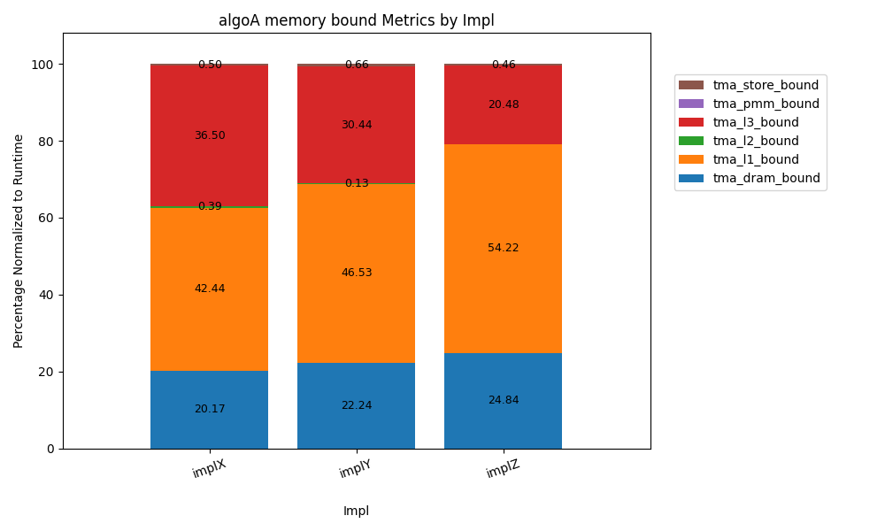
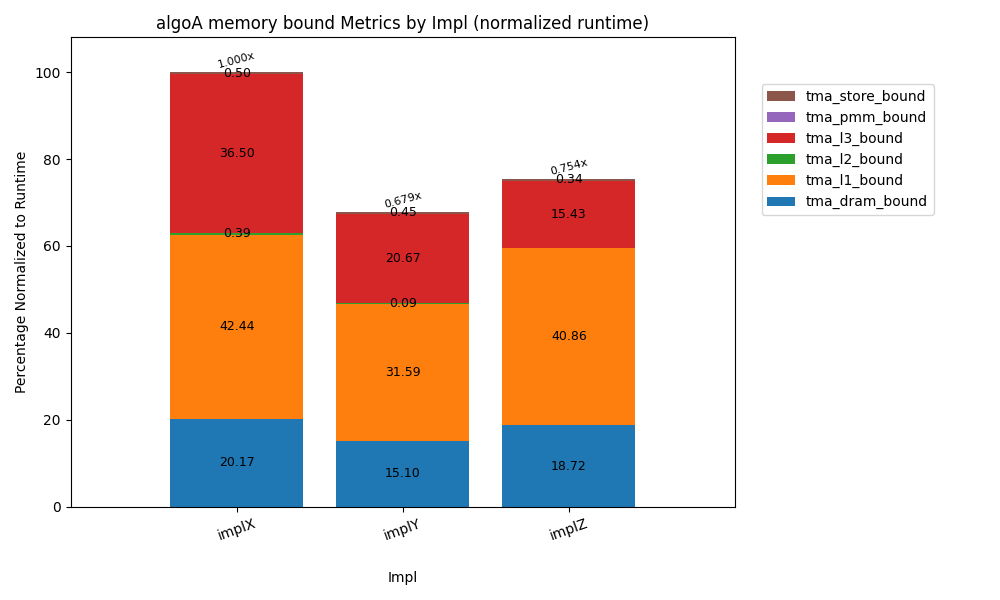
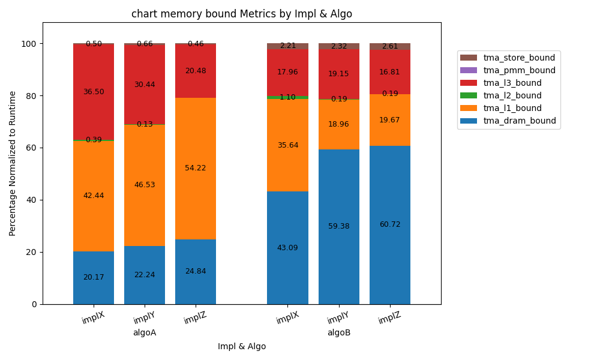
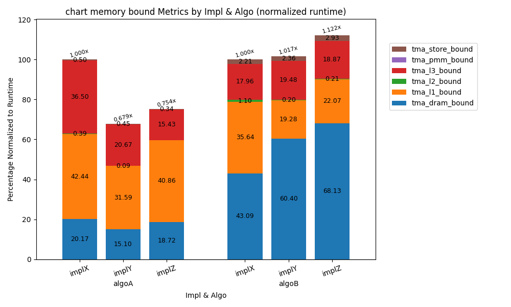

# Top Down Analysis Bar Charts

Author: Angus Wu

Last Updated: Sep 6, 2024

## Objective

The top down methodology for performance analysis is a powerful tool to identify performance bottlenecks.
This script generates bar charts to better visualize the output from the Linux `perf stat -e/-M -d` options.


## Dependencies

This code has only been tested with Python 3.11.5 and Intel Cascade Lake

Libraries used: `Pandas`, `Matplotlib`


## Usage

```
# Run your program with Perf.
# You can find the available -e and -M options by reading the output of `perf list`

perf stat -e <events> -M <metrics> -d <your program command> > <logfile>`


# Edit the options in the main/default function in `./tda_barcharts.py`

python3 <path_to>/tda_barcharts.py
```


## Sample Output

The script supports multiple levels of hierarchies.

It also supports a "Relative" and "Non-Relative" mode, where for each group of bars, the subsequent bars in the group are normalized to the runtime of the first bar of the group.

### Single Level Hierarchy
 

### Two Level Hierarchy
 


## Demo

The demo includes top down data and runtime data. It is also preconfigured with the perflist file specific to the architecture used to generate the top down data.

Two examples are included in the python file (refer to comments in `main`). Run the code below. It should generate charts in `./demo/td_charts`.

```
cd ./demo
python3 ../tda_barcharts.py
```